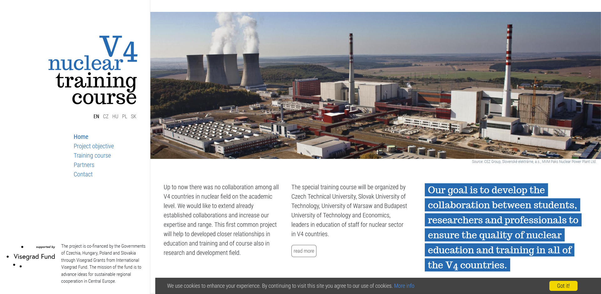

## Website of V4 Nuclear Training Course project
 &nbsp; &nbsp;
  
## Description
**The webiste, created for V4 Nuclear Training Course project**, consists of 5 pages: Home, Project objective, Training course, Partners, Contact. Every page was translated into four languages: English, Czech, Slovak and Polish.

Visit ma web page: **http://v4nuclear.fuw.edu.pl**.

> The goal of the V4 Nuclear Training Course project is to develop the collaboration between students, researchers and professionals to ensure the quality of nuclear education and training in all of the V4 countries. This first common project will help to developed closer relationships in education and training and of course also in research and development field. The special training course will be organized in 2021 by Czech Technical University, Slovak University of Technology, University of Warsaw and Budapest University of Technology and Economics, leaders in education of staff for nuclear sector in V4 countries.

The website was launched in **March 2020**.
  
## Technologies
Project is created with:
* HTML5
* CSS3
* JavaScript
  
## Screenshot

